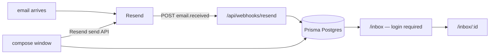

# riov-inbox

Email inbox for Riov. Receives inbound emails via Resend webhook and displays them at [inbox.riov.com.br](https://inbox.riov.com.br), behind a custom JWT login (no NextAuth/Clerk — see `CLAUDE.md` → Auth).



## run

```bash
pnpm install
pnpm db:generate
pnpm db:push            # first time only — creates tables
pnpm db:seed-labels     # seeds Clientes/Financeiro/Produto labels
pnpm user:create you@riov.com.br yourpassword "Your Name"
pnpm dev
```

Copy `.env.example` → `.env.local` and fill in `DATABASE_URL`, `AUTH_SECRET`, `RESEND_API_KEY`, and `RESEND_WEBHOOK_SECRET`.

## Conventions

### Separation of Types and Logic

To keep the codebase modular, maintainable, and readable, we strictly separate TypeScript type definitions from executable logic:

- Keep all complex types (such as webhook payloads, API request/response shapes, and action parameters) in a separate `types.ts` file located in the same directory as the logical file (e.g., `app/api/webhooks/resend/types.ts` alongside `route.ts`).
- Business logic or route handlers should only focus on execution, importing types from their local sibling files.
